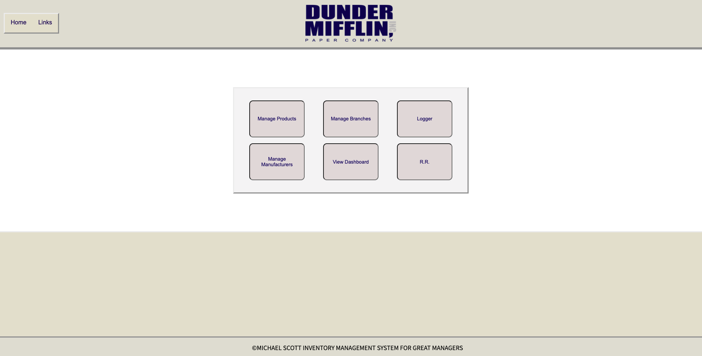

# "Multi Store" Inventory Management Project

## Project Brief
________________________________________________________________________________________________________________________________________________________________

#### *Shop Inventory*

Build an app which allows a shopkeeper to track their shop's inventory. This is not an app which the customer will see, it is an admin/management app for the shop workers.

#### MVP
1. The inventory should track individual products, including a name, description, stock quantity, buying cost, and selling price.
2. The inventory should track manufacturers, including a name and any other appropriate details.
3. The shop can sell anything you like, but you should be able to create and edit manufacturers and products separately.
4. This might mean that it makes more sense for a car shop to track makes and models of cars. Or a bookstore might sell books by author, or by publisher, and   not by manufacturer. You are free to name classes and tables as appropriate to your project.
5. Show an inventory page, listing all the details for all the products in stock in a single view.
6. As well as showing stock quantity as a number, the app should visually highlight "low stock" and "out of stock" items to the user.

Inspired by eBay, Amazon (back end only), Magento

#### Possible Extensions
1. Calculate the markup on items in the store, and display it in the inventory
2. Filter the inventory list by manufacturer. For example, provide an option to view all books in stock by a certain author.
3. Categorise your items. Books might be categorised by genre (crime, horror, romance...) and cars might be categorised by type (SUV, coupé, hatchback...). Provide an option to filter the inventory list by these categories.
4. Mark manufacturers as active/deactivated. Deactivated manufacturers will not appear when creating new products.

## Running the app
________________________________________________________________________________________________________________________________________________________________

1. Once saved locally, in terminal open folder solo_inventory_project.

2. First step is to setup and run database. Commands for creating and running db:

    * *createdb dunder_mifflin_inventory*

    * *psql -d dunder_mifflin_inventory -f db/dunder_mifflin_inventory.sql*

3. Now that the db is setup and running, we can now run the app. In the main folder solo_inventory_project run the following command:

    * *flask run*

4. Open browser (preferably Chrome) and navigate to either http://127.0.0.1:5000/ or http://localhost:5000/. You will see the following screen:

